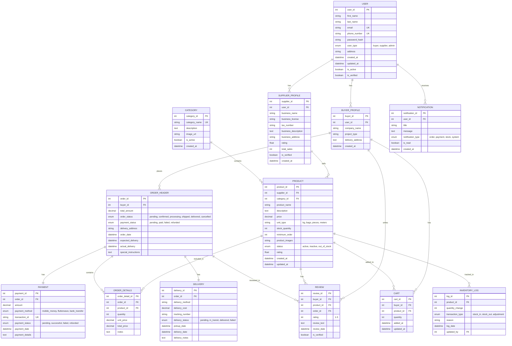

# E-commerce Database ER Diagram

```mermaid
erDiagram
    USER {
        int user_id PK
        string first_name
        string last_name
        string email UK
        string phone_number UK
        string password_hash
        enum user_type "buyer, supplier, admin"
        string address
        datetime created_at
        datetime updated_at
        boolean is_active
        boolean is_verified
    }
    
    SUPPLIER_PROFILE {
        int supplier_id PK
        int user_id FK
        string business_name
        string business_license
        string tax_number
        text business_description
        string business_address
        float rating
        int total_sales
        boolean is_verified
        datetime created_at
    }
    
    BUYER_PROFILE {
        int buyer_id PK
        int user_id FK
        string company_name
        string project_type
        text delivery_address
        datetime created_at
    }
    
    CATEGORY {
        int category_id PK
        string category_name UK
        text description
        string image_url
        boolean is_active
        datetime created_at
    }
    
    PRODUCT {
        int product_id PK
        int supplier_id FK
        int category_id FK
        string product_name
        text description
        decimal price
        string unit_type "kg, bags, pieces, meters"
        int stock_quantity
        int minimum_order
        string product_images
        enum status "active, inactive, out_of_stock"
        float rating
        datetime created_at
        datetime updated_at
    }
    
    ORDER_HEADER {
        int order_id PK
        int buyer_id FK
        decimal total_amount
        enum order_status "pending, confirmed, processing, shipped, delivered, cancelled"
        enum payment_status "pending, paid, failed, refunded"
        string delivery_address
        datetime order_date
        datetime expected_delivery
        datetime actual_delivery
        text special_instructions
    }
    
    ORDER_DETAILS {
        int order_detail_id PK
        int order_id FK
        int product_id FK
        int quantity
        decimal unit_price
        decimal total_price
        text notes
    }
    
    PAYMENT {
        int payment_id PK
        int order_id FK
        decimal amount
        enum payment_method "mobile_money, flutterwave, bank_transfer"
        string transaction_id UK
        enum payment_status "pending, successful, failed, refunded"
        datetime payment_date
        text payment_details
    }
    
    CART {
        int cart_id PK
        int buyer_id FK
        int product_id FK
        int quantity
        datetime added_at
        datetime updated_at
    }
    
    REVIEW {
        int review_id PK
        int buyer_id FK
        int product_id FK
        int order_id FK
        int rating "1-5"
        text review_text
        datetime review_date
        boolean is_verified
    }
    
    INVENTORY_LOG {
        int log_id PK
        int product_id FK
        int quantity_change
        enum transaction_type "stock_in, stock_out, adjustment"
        string reason
        datetime log_date
        int updated_by FK
    }
    
    NOTIFICATION {
        int notification_id PK
        int user_id FK
        string title
        text message
        enum notification_type "order, payment, stock, system"
        boolean is_read
        datetime created_at
    }
    
    DELIVERY {
        int delivery_id PK
        int order_id FK
        string delivery_method
        decimal delivery_cost
        string tracking_number
        enum delivery_status "pending, in_transit, delivered, failed"
        datetime pickup_date
        datetime delivery_date
        text delivery_notes
    }
    
    %% Relationships
    USER ||--o{ SUPPLIER_PROFILE : "has"
    USER ||--o{ BUYER_PROFILE : "has"
    USER ||--o{ NOTIFICATION : "receives"
    
    SUPPLIER_PROFILE ||--o{ PRODUCT : "sells"
    BUYER_PROFILE ||--o{ ORDER_HEADER : "places"
    BUYER_PROFILE ||--o{ CART : "has"
    BUYER_PROFILE ||--o{ REVIEW : "writes"
    
    CATEGORY ||--o{ PRODUCT : "contains"
    
    PRODUCT ||--o{ ORDER_DETAILS : "included_in"
    PRODUCT ||--o{ CART : "added_to"
    PRODUCT ||--o{ REVIEW : "has"
    PRODUCT ||--o{ INVENTORY_LOG : "tracked_in"
    
    ORDER_HEADER ||--o{ ORDER_DETAILS : "contains"
    ORDER_HEADER ||--|| PAYMENT : "has"
    ORDER_HEADER ||--|| DELIVERY : "has"
    ORDER_HEADER ||--o{ REVIEW : "reviewed_in"
```
